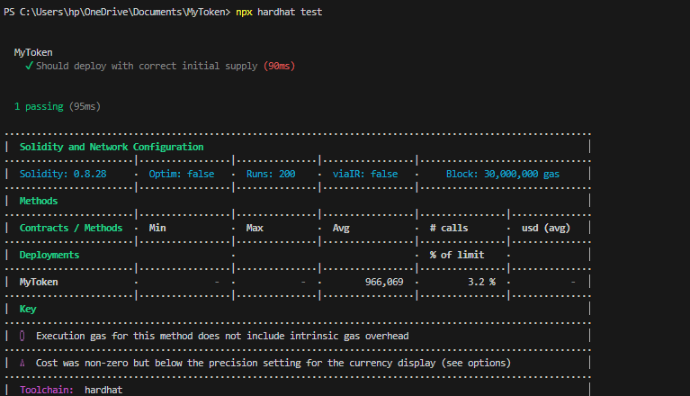

# MyToken

**MyToken** is a custom ERC-20 token created using Solidity and deployed using Hardhat. It represents a basic cryptocurrency that can be transferred between wallets on the Ethereum blockchain.

---

## 🔧 Tech Stack

- **Solidity** – Smart contract programming language  
- **Hardhat** – Smart contract development environment  
- **JavaScript** – Used for scripting and testing  
- **VS Code** – Code editor  
- **MetaMask** – Wallet to manage tokens  
- **Git & GitHub** – Version control and hosting  

---

## 🛠️ Features

- ERC-20 compatible token  
- Initial supply minted on deployment  
- Transferable between accounts  
- Tested using Hardhat  

---

## 📁 Project Structure
MyToken/
├── contracts/
│ └── MyToken.sol
├── scripts/
│ └── deploy.js
├── test/
│ └── MyTokenTest.js
├── screenshots/
│ └── mytoken-test.png
├── hardhat.config.js
├── package.json
└── README.md

---

## ✅ Test Result Screenshot

This screenshot shows that the smart contract passed the test:




---

## 🚀 How to Deploy Locally

```bash
npx hardhat run scripts/deploy.js --network hardhat

✨ Author
Nimra Batool
Aspiring Blockchain Developer | Solidity | Smart Contracts | Web3.js


 
